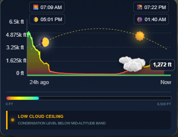
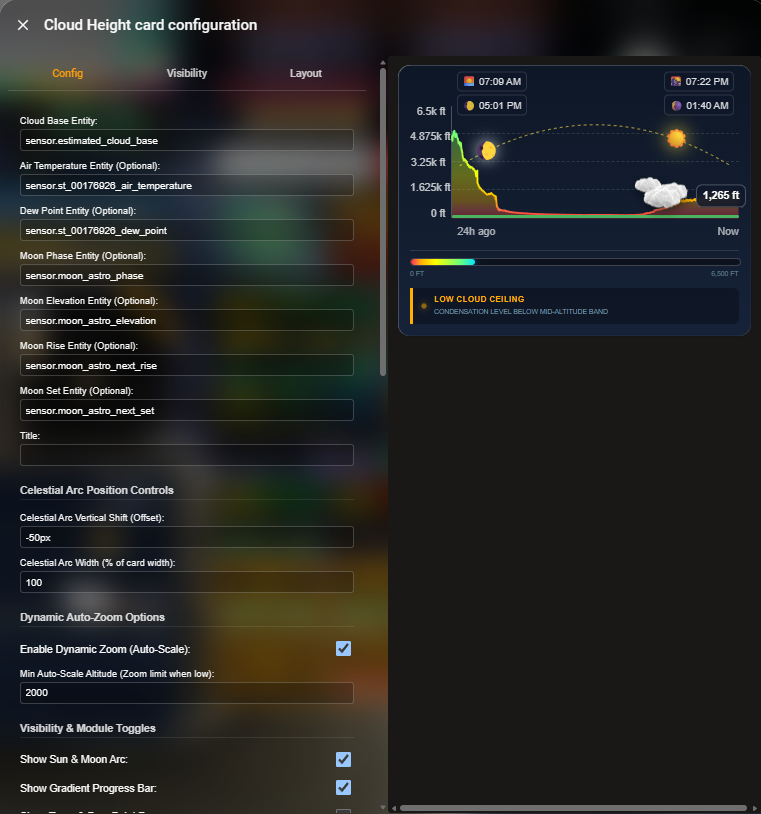

# Cloud Height Card for Home Assistant

<p align="center">
  <a href="https://my.home-assistant.io/redirect/hacs_repository/?owner=dutchsines&repository=cloud-height-card&category=Lovelace" target="_blank" rel="noreferrer noopener">
    
  </a>
</p>

<p align="center">
  <a href="https://hacs.xyz/"></a>
  <a href="https://github.com/dutchsines/cloud-height-card/releases/latest"></a>
  <a href="https://github.com/dutchsines/cloud-height-card/blob/main/LICENSE"></a>
  
</p>

<p align="center">
  
  
</p>

A custom Lovelace card for Home Assistant that visualizes real-time cloud elevation, altitude trends over time, and live sun/moon positions along a parabolic sky arch.

---

## Features
- ☁️ **Dynamic Sky Visualization:** Renders an animated cloud graphic at the real-time altitude reported by your sensor.
- 📈 **Historical Trendline:** Embeds an SVG graph showing altitude changes over a customizable time window (e.g., 24h) with intermediate time markers across the bottom axis.
- 📏 **Responsive Layout & Dynamic Width:** The Y-axis automatically auto-fits its width based on text length to prevent any text or graph overlap, even when using dual height displays.
- 📐 **Flexible Unit System:** Supports automatic Home Assistant native units, forced Imperial (`ft`, `°F`), Metric (`m`, `°C`), or Dual-Unit readouts (`ft (m)` / `°F (°C)`).
- ☀️ **Celestial Tracking:** Tracks real-time Sun and Moon elevation along a parabolic arc with accurate moon phases, sunrise, sunset, moonrise, and moonset time badges.
- 🎨 **Color Thresholds & Blending:** Smoothly transitions or hard-cuts graph colors based on cloud height (e.g., red for fog, yellow for low ceiling, blue for high elevation).
- 🔎 **Dynamic Dynamic Zoom / Auto-Scale:** Automatically scales the graph view ceiling based on historical peaks to eliminate dead space, or can be overridden to a fixed maximum.
- ⚙️ **Dashboard Customization:** Fully configurable via YAML or the built-in visual editor (font sizes, card height, module layout ordering, ground colors, and cloud size).

---

## ☁️ Creating an Estimated Cloud Base Sensor

If you don't already have an entity providing cloud base elevation, you can easily create one in Home Assistant using a **Template Sensor**. The sensor uses the standard Spread Formula:

$$\text{Cloud Base (ft)} = \left( \frac{\text{Temperature} - \text{Dew Point}}{4.4} \right) \times 1000$$

Add one of the following snippets to your `configuration.yaml` (or `templates.yaml`) and replace the sample entity IDs with your local weather sensors.

### Option A: Imperial Units (°F)

```yaml
template:
  - sensor:
      - name: "Estimated Cloud Base"
        unique_id: estimated_cloud_base_ft
        unit_of_measurement: "ft"
        icon: "mdi:cloud-outline"
        state_class: measurement
        state: >
          
          
          
            {{ (((temp - dew) / 4.4) * 1000) | round(0) }}
          
            unavailable
          
