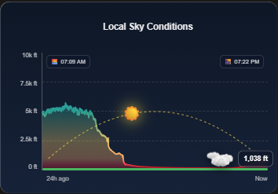

# Cloud Height Card
  <a href="https://hacs.xyz/"></a>
  <a href="https://github.com/dutchsines/cloud-height-card/releases/latest"></a>
  <a href="https://github.com/dutchsines/cloud-height-card/blob/main/LICENSE"></a>
  
</p>

<p align="left">
  
</p>
<p align="right">
  
</p>
# Cloud Height Card for Home Assistant

A custom Lovelace card that visualizes real-time cloud elevation, altitude trends over time, and live sun/moon positions along a parabolic sky arch.

## Features
- **Dynamic Sky Visualization:** Renders an animated cloud graphic at the real-time altitude reported by your sensor.
- **Historical Trendline:** Embeds an SVG graph showing altitude changes over a customizable time window (e.g., 24h).
- **Celestial Tracking:** Tracks real-time Sun and Moon elevation along a parabolic arc complete with sunrise and sunset badges.
- **Color Thresholds & Blending:** Smoothly transitions or hard-cuts graph colors based on cloud height (e.g., red for fog, yellow for low ceiling, blue for high elevation).
- **Dashboard Customization:** Fully configurable via YAML or the built-in visual editor (font sizes, card height, ground colors, and cloud size).

## ☁️ Creating an Estimated Cloud Base Sensor

If you don't already have an entity providing cloud base elevation, you can easily create one in Home Assistant using a **Template Sensor**! The sensor uses the standard Spread Formula:

$$\text{Cloud Base (ft)} = \left( \frac{\text{Temperature} - \text{Dew Point}}{4.4} \right) \times 1000$$

Add one of the following snippets to your `configuration.yaml` (or `templates.yaml`) and replace the sample entity IDs with your local outdoor temperature and dew point sensors.

### Option A: Imperial Units (°F)

```yaml
template:
  - sensor:
      - name: "Estimated Cloud Base"
        unique_id: estimated_cloud_base_ft
        unit_of_measurement: "ft"
        icon: "mdi:cloud-outline"
        state_class: measurement
        state: >
          
          
          
            {{ (((temp - dew) / 4.4) * 1000) | round(0) }}
          
            unavailable
          

Metric Units (°C)
If your weather station outputs temperature and dew point in Celsius, divide by 2.5 instead
template:
  - sensor:
      - name: "Estimated Cloud Base"
        unique_id: estimated_cloud_base_m
        unit_of_measurement: "m"
        icon: "mdi:cloud-outline"
        state_class: measurement
        state: >
          
          
          
            {{ (((temp - dew) / 2.5) * 1000) | round(0) }}
          
            unavailable
          

## Installation

### Method 1: Manual Installation
1. Download `cloud-height-card.js` from the latest release.
2. Copy `cloud-height-card.js` to your Home Assistant configuration directory under `/config/www/cloud-height-card.js`.
3. In Home Assistant, go to **Settings** -> **Dashboards** -> **Resources** (top right three dots).
4. Add a new resource:
   - **URL:** `/local/cloud-height-card.js`
   - **Resource Type:** `JavaScript Module`
5. Refresh your browser (**Ctrl + F5** / **Cmd + Shift + R**).

### Method 2: HACS (Custom Repository)
1. Open **HACS** in Home Assistant.
2. Click the three dots in the top-right corner and select **Custom repositories**.
3. Add repository URL: `https://github.com/YOUR_GITHUB_USERNAME/cloud-height-card`
4. Category: **Lovelace**
5. Click **Add**, then find and install **Cloud Height Card**.

    <a href="https://my.home-assistant.io/redirect/hacs_repository/?owner=dutchsines&repository=cloud-height-card&category=Lovelace" target="_blank" rel="noreferrer noopener"></a>
<p align="center">
---

## Configuration Example

```yaml
type: custom:cloud-height-card
entity: sensor.estimated_cloud_base
title: Local Sky Conditions
max_altitude: 10000
hours_to_show: 24
card_height: 200px
blend_colors: true

# Font & Sizing Overrides
title_font_size: 1.1rem
axis_font_size: 0.75rem
badge_font_size: 0.85rem
cloud_size: 50px
celestial_size: 1.8rem

# Color Customizations
ground_color: '#4ab561'
arc_color: '#fde047'
bg_gradient: 'linear-gradient(180deg, #0e1726 0%, #162238 100%)'

# Altitude Color Thresholds
color_0: '#8b0000'     # Fog / Ground level
color_500: '#e63946'   # Very low ceiling
color_1000: '#f4a261'  # Low altitude
color_2500: '#e9c46a'  # Mid altitude
color_5000: '#2a9d8f'  # High altitude
color_8000: '#38bdf8'  # Very high ceiling
```

## Options

| Parameter | Type | Default | Description |
| :--- | :--- | :--- | :--- |
| `entity` | String | **Required** | Cloud height sensor entity ID |
| `title` | String | `Cloud Elevation` | Card header title |
| `max_altitude` | Number | `10000` | Y-axis ceiling limit |
| `hours_to_show` | Number | `24` | Hours of history to draw on graph |
| `card_height` | String | `200px` | Height of the viewport area |
| `blend_colors` | Boolean | `true` | `true` for smooth gradients, `false` for hard bands |
| `cloud_gif` | String | Default GIF | Custom image/GIF URL or `/local/my_cloud.gif` |
| `title_font_size` | String | `1rem` | Header title font size |
| `axis_font_size` | String | `0.7rem` | X and Y axis labels font size |
| `badge_font_size` | String | `0.8rem` | Altitude badge font size |
| `celestial_size` | String | `1.8rem` | Sun & Moon icon font size |
| `ground_color` | String | `#4ab561` | Ground bar color |
| `arc_color` | String | `#fde047` | Sun trajectory arch color |
| `bg_gradient` | String | CSS Gradient | Background gradient style |
